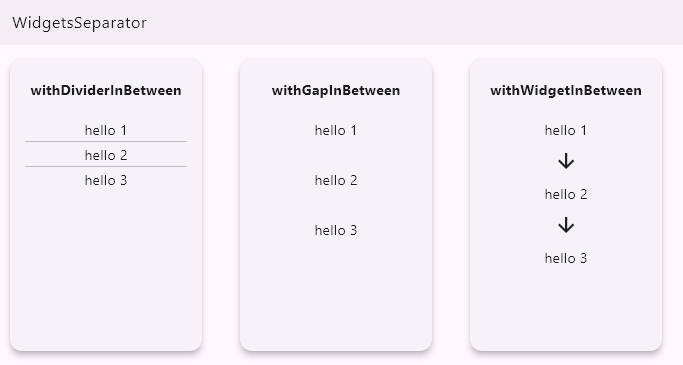

# flutter_handy_utils

The `flutter_handy_utils` package is a **community-driven** project designed to simplify common tasks in Flutter development. It offers a wide range of utility functions, extensions and widgets that make building Flutter apps easy. Below is everything you need to know about using, contributing, and staying involved with the package.

## Features

### Utils:

- TreeBuilder: structured parent-child relationships.

### Extensions:

- **WidgetsSeparator**: Easily separate widgets in a List by adding a gap, divider, or any custom widget in between them.

  - `withGapInBetween(double gapSize)`: Adds a gap of the specified size between each widget.
  - `withDividerInBetween(...)`: Adds a customizable divider between each widget.
  - `withWidgetInBetween(Widget widget)`: Adds any custom widget between each item in the list.

- **StringEllipsSize**: Returns a new string truncated from the start or end to the specified maximum length.

### Widgets

- GroupedRadioButton: A widget that displays a group of radio buttons.

## Usage

> ### TreeBuilder:

creating structured parent-child relationship using the `TreeBuilder` util.

1. make a list of `TreeInputItem`:

   ```dart
   final list = [
      TreeInputItem<T>(id: int, parentId: int, data: <T>)
      TreeInputItem<T>(id: int, parentId: int, data: <T>)
      TreeInputItem<T>(id: int, parentId: int, data: <T>)
   ];
   ```

2. create an instance of TreeBuilder with the given type:

   ```dart
   final treeBuilder = TreeBuilder<T>();
   ```

3. make the structured parent-child relationship using:

   ```dart
   final result = treeBuilder.buildTree(list);
   ```

the result will be a `List<TreeOutPutItem<T>>` which contain the parent item and its children.

> ### WidgetsSeparator:

separates the list of widgets by adding a gap or divider in between them.

 <!-- Showcase image placeholder -->

<p align="start" >
   
</p>

`withDividerInBetween`:

```dart
   listOfWidgets.withDividerInBetween(
        color: Colors.red,
        height: 20,
        thickness: 20,
        indent: 20,
        endIndent: 20,
      );

```

`withGapInBetween`:

```dart
   listOfWidgets.withGapInBetween(gapSize: 20);
```

`withWidgetInBetween`:

```dart
   listOfWidgets.withWidgetInBetween(
                  const Padding(
                    padding: EdgeInsets.symmetric(vertical: 10),
                    child: Icon(Icons.arrow_downward),
                  ),
                );
```

> ### StringEllipsSize:

Returns a new string truncated from the start or end to the specified maximum length.

```dart
String text = "This is a very long string";

String truncatedText = text.ellipsSize(maxLength: 10);
print(truncatedText); // "This is a..."

String truncatedTextFromStart = text.ellipsSize(maxLength: 10, fromStart: true);
print(truncatedTextFromStart); // "...very long string".

```

> ### GroupedRadioButton:

displays a group of radio buttons, where only one radio button can be selected at a time. The radio buttons are displayed in a column layout.

```dart
GroupedRadioButton<String>(
  items: [
    GroupedRadioButtonItem(title: Text("Option 1"), value: "option1"),
    GroupedRadioButtonItem(title: Text("Option 2"), value: "option2"),
  ],
  onChanged: (value) {
    print(value);
  },
  initialGroupValue: "option1",
),

```

---

<br/>
<br/>
<br/>

## Additional information

### About the Author

Hi there! 👋 I'm **Jafar Rezazadeh**, a software developer with a deep love for building high-quality, scalable, and efficient solutions in both **Dart** and **Flutter**. With a strong background in mobile development, I enjoy contributing to the open-source community and helping other developers with tools and libraries that make their projects more seamless and powerful.

I created this package to offer a set of handy utilities that can simplify everyday development tasks. Whether you're working on a small project or a large-scale application, these tools are designed to make your workflow more efficient and streamlined. My goal is to provide developers with a versatile and easy-to-use toolkit that can be quickly integrated into various projects, helping you focus more on building great features and less on repetitive coding tasks.

Feel free to reach out if you have any questions, suggestions, or just want to connect! You can find Via [GitHub - Jafar.Rezazadeh](https://github.com/Jafar-Rezazadeh), or mail to [jafarrezazadeh76@gmail.com](mailto:jafarrezazadeh76.gmail.com).

### 🤝 How to Contribute:

Contributions are always welcome! You can get involved in a variety of ways:

1. **Fork the Repository**:
   - Start by forking the [GitHub repository](https://github.com/Jafar-Rezazadeh/flutter_handy_utils/tree/master) to your account.
2. **Create a New Branch**:
   - Make your improvements, whether it's bug fixes, new features, or enhancing the documentation.
3. **Submit a Pull Request**:
   - Once done, submit a PR with a detailed explanation of the changes.

#### 🔧 Code Standards:

- Ensure that your code follows the project's coding style and conventions.
- Contributions should be accompanied by **unit tests** to ensure the stability of the package.

### 🐛 Filing Issues:

Encounter a problem or have a suggestion? You can:

- **Report Bugs**: Head to the **GitHub Issues page** and provide detailed information, including:
  - Your Flutter version
  - Steps to reproduce the issue
  - Any relevant logs or error messages
- **Request New Features**: If you have ideas for improvements or new utilities, feel free to submit a **feature request** via the GitHub Issues page.

### 📬 Response from the Package Authors:

- **Issue Response Time**: The maintainers strive to respond to issues within a few days. However, complex issues may take longer to resolve.
- **Community Involvement**: Other contributors may also assist with questions, issues, and pull request reviews.

### 🌟 Getting More Involved:

- **Join Discussions**: If you have general questions, ideas, or want to collaborate, consider participating in **GitHub Discussions** if available.

---

By contributing to `flutter_handy_utils`, you become part of a community dedicated to making Flutter development smoother and more efficient for everyone!
